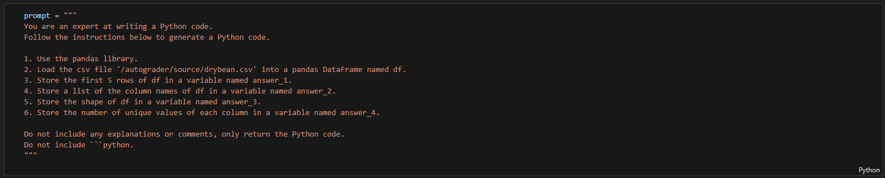
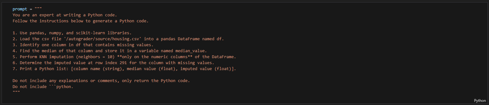

# Project 01: Data Exploration and Prompt Engineering

This project focuses on exploring two datasets and using prompt engineering to generate Python code with the **OpenAI API** for automated data analysis and preprocessing.

## Overview
The goal of this project was to use Large Language Models (LLMs) to:
- Generate Python code for dataset exploration.
- Handle missing values using machine learning-based imputation.
- Test and validate the outputs through the OpenAI API (GPT-4o-mini).

---

## Question 1: Dry Bean Dataset Exploration
**Objective:**  
Use prompt engineering to generate Python code that performs dataset exploration.

**Prompt Used:**  

  

**Generated files:**
- `hw1_q1_prompt.txt`: The text prompt used to generate the code.  
- `q1_generated_code.py`: The Python script produced by the LLM and verified.  
- `drybean.csv`: Dataset used for analysis.

---

## Question 2: California Housing Dataset Imputation
**Objective:**  
Use the OpenAI API to generate Python code that identifies missing values and performs KNN imputation.

**Prompt Used:**  

  

**Generated files:**
- `hw1_q2_prompt.txt`: The prompt used to generate the solution code.  
- `q2_generated_code.py`: The generated Python script that executes the imputation.  
- `housing.csv`: Dataset containing missing values used for testing.

---

## Tools and Technologies
- **Python**
- **Pandas**, **NumPy**, **scikit-learn**
- **OpenAI API (GPT-4o-mini)**

---

## Author
Developed by **Saif Alomari** as part of the *Machine Learning Design and Test Automation* coursework.
