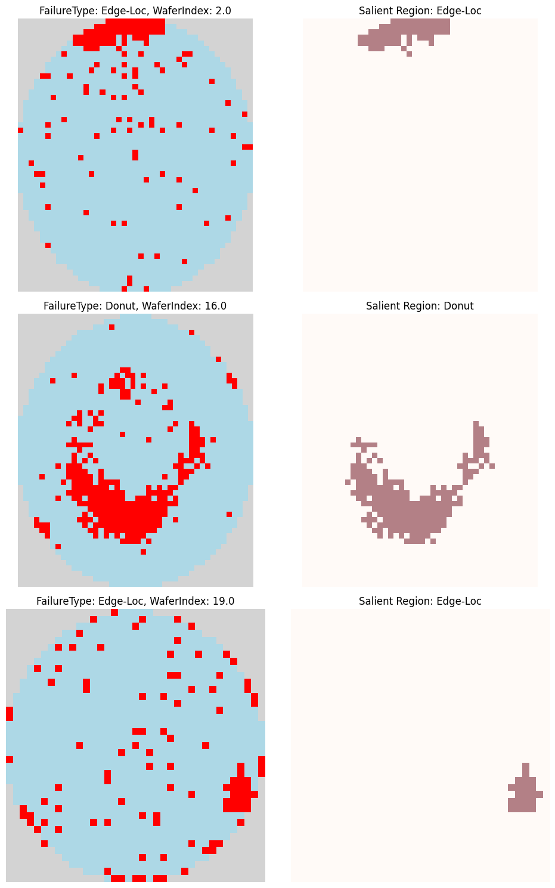

# Wafer Map Failure Pattern Classification

This project builds a machine learning pipeline to classify semiconductor wafer map failure patterns from the WM-811K dataset. Starting from raw wafer map images, the pipeline performs feature engineering by extracting 10 geometric descriptors from each wafer's salient failure region, then trains and evaluates a Decision Tree and a Support Vector Classifier to identify five failure types: Center, Donut, Edge-Loc, Near-full, and Scratch. The project was completed as part of ECE 157A / 272A using an LLM-assisted development workflow documented inline throughout the notebook.


## Dataset

The WM-811K dataset contains real-world wafer maps collected from semiconductor fab processes. Each entry includes six fields: dieSize, failureType, lotName, trainTestLabel, waferIndex, and waferMap. The waferMap field is a 2D numpy array where each cell represents a die with one of three values: 0 for no die, 1 for a passing die, and 2 for a failing die. The training set used in this project contains 2746 labeled samples across five failure types.

## Feature Engineering

Rather than feeding raw pixel arrays into a classifier, 10 geometric features are extracted from each wafer map to capture the spatial structure of its failure pattern. The first step is to identify the salient region, which is the largest connected component of failing dies in the wafer map. Connected component labeling with 8-connectivity is applied to the binary fail mask, and the region with the maximum area is selected as the salient region.



The 10 engineered features computed from each wafer are as follows. The area ratio is the fraction of the salient region relative to the total valid die area. The perimeter ratio is the perimeter of the salient region normalized by the wafer diagonal radius. The maximum and minimum distances from the salient region pixels to the wafer center capture how far the failure zone extends from the center. The major and minor axis ratios are computed by fitting an ellipse to the salient region and normalizing each axis length by the wafer radius. Solidity describes the proportion of the salient region that fills its convex hull. Eccentricity measures how elongated the salient region is. Yield loss is the ratio of all failed dies to total valid dies across the full wafer. Edge yield loss is the same ratio computed only over the outermost two rings of the wafer, identified by iterative morphological erosion from the wafer boundary inward.

## Models

Two classifiers are trained on the 10 engineered features after splitting the labeled training data into a training set and a validation set using a fixed random seed.

The Decision Tree classifier is trained with a maximum depth of 3, keeping the model interpretable and easy to visualize. The Support Vector Classifier uses an RBF kernel and is trained without depth restrictions, allowing it to learn more complex decision boundaries in feature space.

Both models are evaluated using overall accuracy and per-class accuracy on both the training and validation sets. Confusion matrices are plotted for each model to identify which failure types are most frequently misclassified. Predictions on the held-out test set are saved as dt_scores.csv and svc_scores.csv with a failureType header column.

## Project Structure

```
wafer_map_classification/
├── Notebook_wafermaps_training_SaifAlomari.ipynb
├── dt_scores.csv
├── svc_scores.csv
├── data/
│   ├── wafermap_train.npy
│   └── wafermap_test.npy
└── wafermaps_by_type_images/
    ├── wafermaps_for_each_failure_type.png
    └── Salient_Region_Example.png
```

## Dependencies

The notebook uses the following Python libraries: numpy, pandas, scikit-learn, scikit-image, matplotlib, seaborn, and openai. The openai library is used to call an LLM inline throughout the notebook as part of the assignment's LLM-assisted development workflow.
