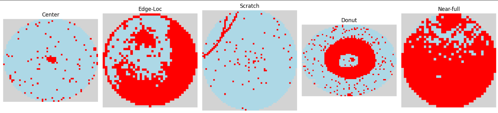

# MachineLearning_Design_and_TestAutomation_SaifAlomari
- Engineer: Saif Alomari
- Date: Fall 2025
- Description: Prompting LLMs for Code Generation. Includes Python notebooks, datasets, and generated code for data analysis and machine learning experiments. This project also integrates the **OpenAI API** to generate, test, and refine Python code automatically through AI-driven prompt engineering. The goal is to explore how Large Language Models (LLMs) can assist in automating parts of the machine learning workflow such as data exploration, preprocessing, and testing.

  

## Contents
- **Project_01:** Focuses on using GPT-based models through the OpenAI API to generate Python code for dataset exploration and missing value handling.
- **Project_02:** Wafer Map Failure Pattern Classification: This project builds a machine learning pipeline to classify semiconductor wafer map failure patterns from the WM-811K dataset. Starting from raw wafer map images, the pipeline performs feature engineering by extracting 10 geometric descriptors from each wafer's salient failure region, then trains and evaluates a Decision Tree and a Support Vector Classifier to identify five failure types: Center, Donut, Edge-Loc, Near-full, and Scratch.

