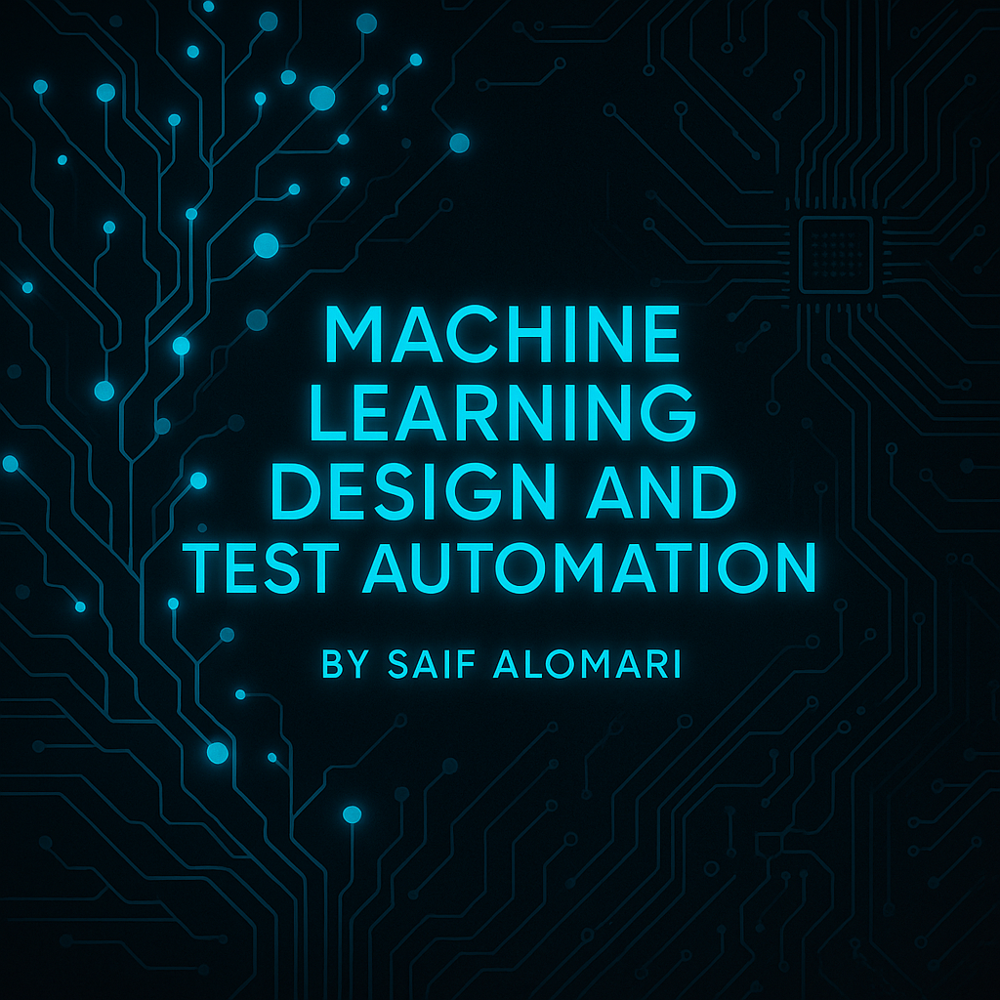

# MachineLearning_Design_and_TestAutomation_SaifAlomari
- Engineer: Saif Alomari
- Date: Fall 2025
- Description: Prompting LLMs for Code Generation. Includes Python notebooks, datasets, and generated code for data analysis and machine learning experiments. This project also integrates the **OpenAI API** to generate, test, and refine Python code automatically through AI-driven prompt engineering. The goal is to explore how Large Language Models (LLMs) can assist in automating parts of the machine learning workflow such as data exploration, preprocessing, and testing.

  

## Contents
- **Project1:** Focuses on using GPT-based models through the OpenAI API to generate Python code for dataset exploration and missing value handling.
